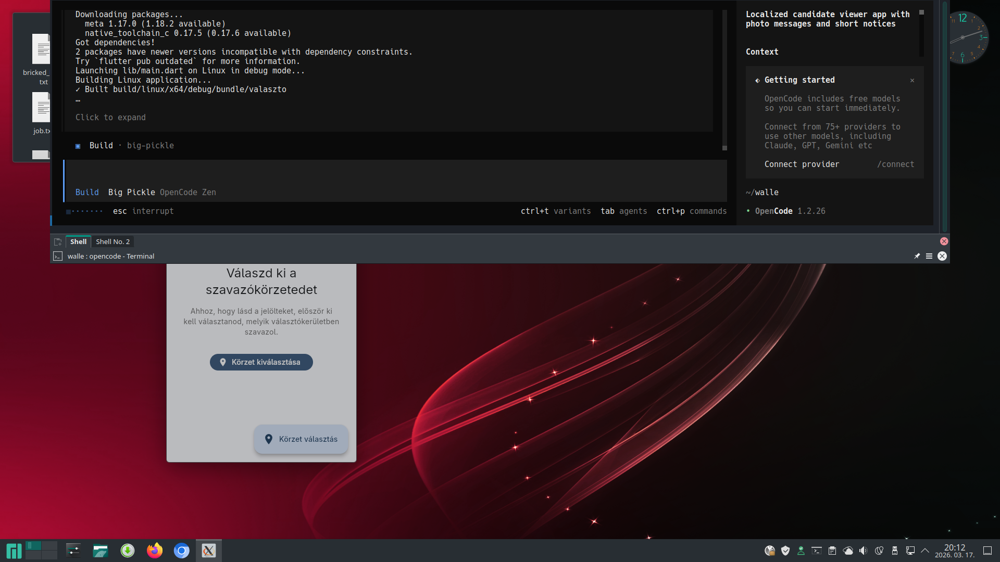
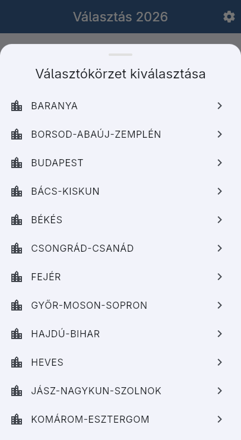
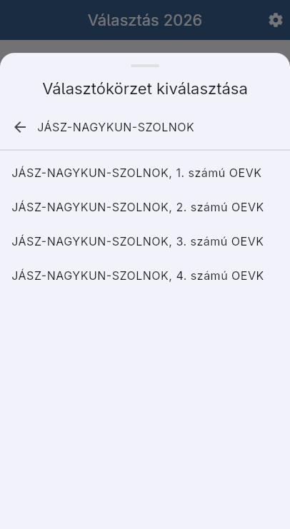
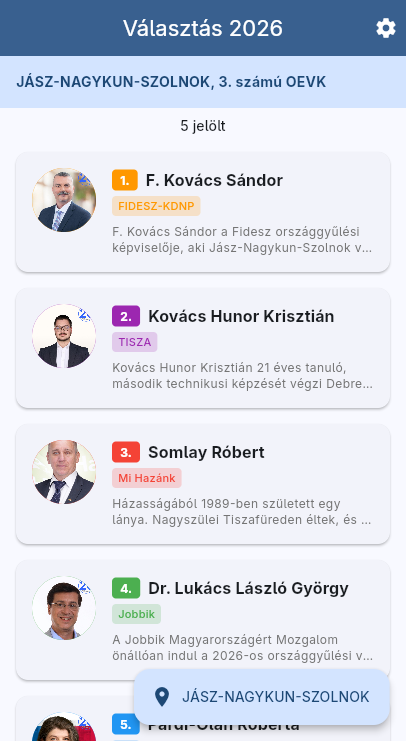
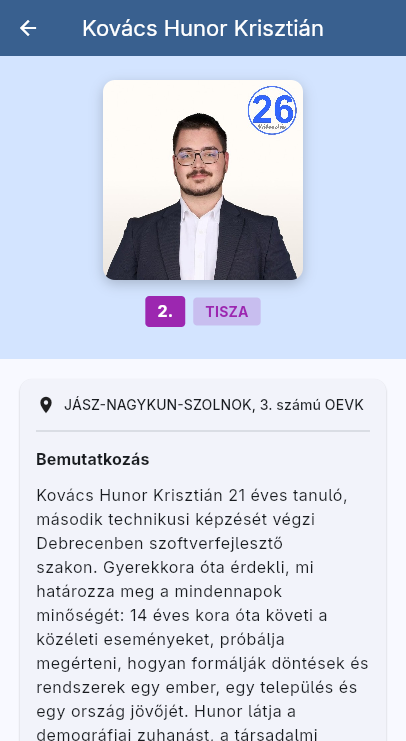

# Választó 2026

2026-os magyar országgyűlési választási jelöltek böngésző alkalmazása.

## Képernyőképek

| Home | Jelölt részletes | Beállítások |
|------|-------------------|--------------|
|  |  |  |

| Körzet kiválasztás | Körzet lista |
|---------------------|---------------|
|  |  |

## Funkciók

- 476 jelölt böngészése
- Körzet választás
- Jelölt részletes adatlapok (kép, párt, bemutatkozás)
- Offline működés

## Letöltés

[APK letöltése](https://github.com/JuliusLongmind/valaszto/releases/download/v1.0.0/app-release.apk)
